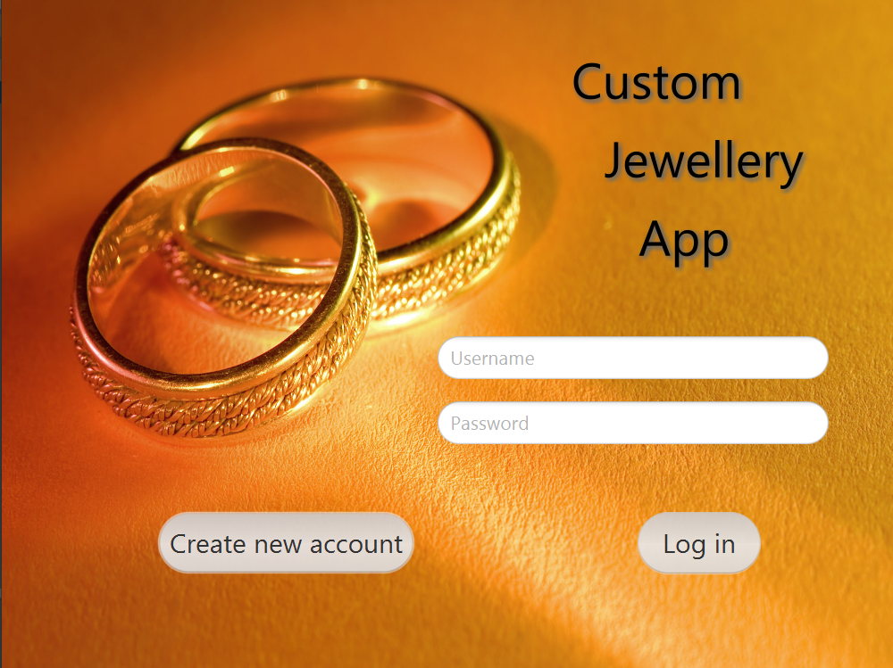
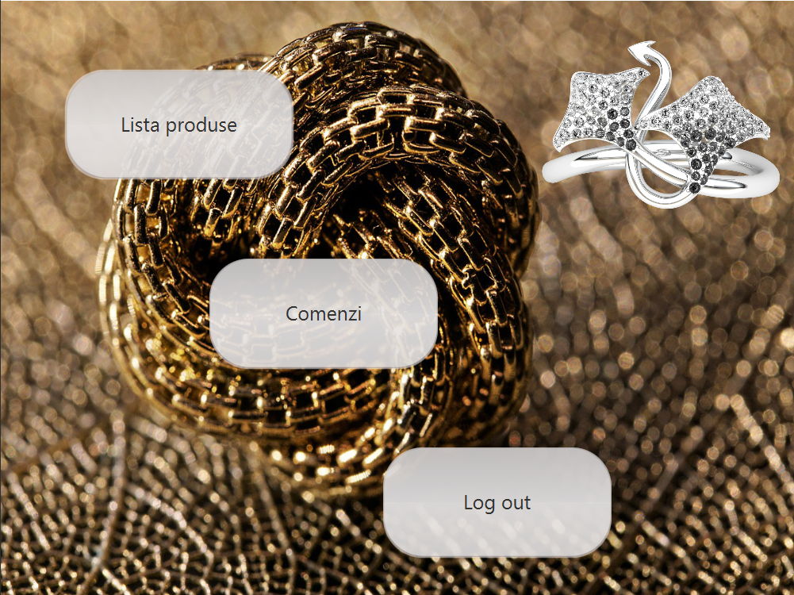
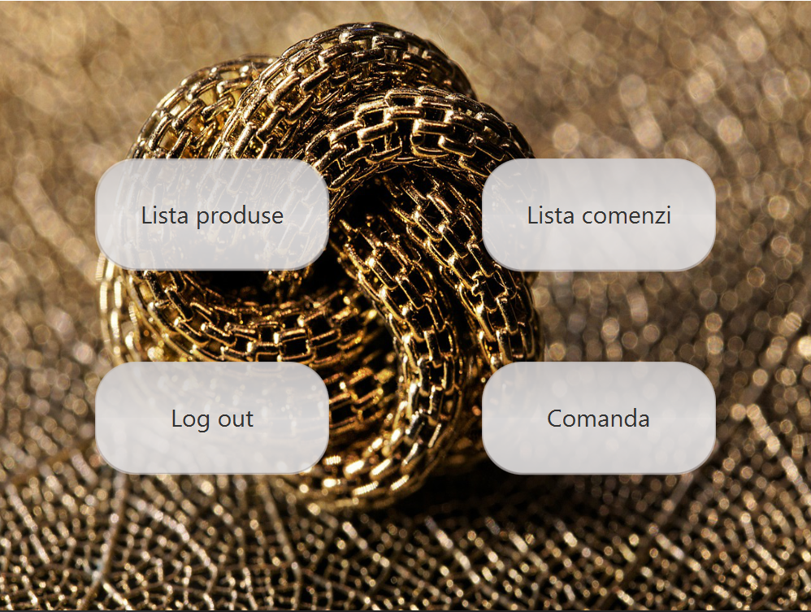

# Custom Jewellery App

## Table of contents

###Application  description
* [General description](#general-description)
* [Technologies used](#technologies-used)
* [Signing up for an account and logging in](#signing-up-for-an-account-and-logging-in)
* [The Admin Account](#the-manager-account)
* [The Client Account](#the-client-account)

###Setup & Run

* [Prerequisites](#prerequisites)
* [Download & Run](#download--run)

###Resources

## Application description

### General description

Custom Jewellery App It is an application that aims to sell personalized jewelry. A customer can order personalized jewelry, with details necessary to make the product (jewelry type, material, engraved message) and they go directly to the jeweler.

### Technologies used
* Java 15
* JavaFX 15 - UI;
* Gradle - dependencies and build tool;
* Nitrite - database operations;

### Signing up for an account and logging in

Before using the platform, every user, be they a jeweler or a client, must sign up for an account. On registration, there are two types of user accounts, based on the aforementioned roles:
* Client
* Manager (Jeweler)

### The Manager Account

After logging in, the manager will be redirected to a home page. The following operations are available here:
* **See and modify a list of products** from where the manager can **add**, **delete**, **modify** products. There are 2 types of products: **product type** and **material**;
* **View orders**, from where the manager can **accept** or **decline** active orders;
* **Log out**, the manager will be redirected to log in;

### The Client Account

After logging in, a client will be redirected to a home page. The following operations are available here:
* **See a list of products**, where the client can see the price of all added products, both types and materials ;
* **See a list of orders**, where the client can see his orders, and the stage they are in;
* **Make a new order** where the client can select type, material and message for his custom jewellery;
* **Log out**, the client will be redirected to log in;

##Setup & Run

###Prerequisites
* **Java 11 or higher**. To check your Java version you can run `java -version` in the command line;
* **Gradle**. To check if you have Gradle installed run `gradle -version` in the command line. If you need to install it, please refer to this [official Gradle docs](https://docs.gradle.org/current/userguide/installation.html); 
* **JavaFX**. Make sure you install JavaFX SDK on your machine, using the instructions provided in the [Official Documentation](https://openjfx.io/openjfx-docs/#install-javafx);

###Download & Run
To set up and run the project locally on your machine, please follow the next steps:

* **Clone the repository**. You can do this using `git clone https://github.com/fis2021/Custom-Jewellery-App.git`;
* **Verify that the project build locally**. Open the project folder in the command line, and you should be able to run `gradle clean build`;
* **Open in Intellij IDEA**;
* **Run the project with Gradle**. To start the project use `gradle run` or `./gradlew run`

##Resources

To understand and learn more about **JavaFX**, you can take a look at some of the following links:
* [Introduction to FXML](https://openjfx.io/javadoc/16/javafx.fxml/javafx/fxml/doc-files/introduction_to_fxml.html)
* [Getting Started with JavaFX](https://openjfx.io/openjfx-docs/)
* [JavaFX Tutorial](https://code.makery.ch/library/javafx-tutorial/)
* [JavaFX Java GUI Design Tutorials](https://www.youtube.com/playlist?list=PL6gx4Cwl9DGBzfXLWLSYVy8EbTdpGbUIG)

To better understand how to use **Nitrite Java**, use the following links:
* [Nitrite Java Github Repository](https://github.com/nitrite/nitrite-java)
* [Nitrite Java Project Page](https://www.dizitart.org/nitrite-database.html)
* [Nitrite Java Documentation Page](https://www.dizitart.org/nitrite-database/)
* [Nitrite Java: Filters](https://www.dizitart.org/nitrite-database/#filter)
* [Nitrite: How to Create an Embedded Database for Java and Android](https://dzone.com/articles/nitrite-how-to-create-an-embedded-database-for-jav)
* [Nitrite: An Embedded NoSQL Database for Java and Android](https://medium.com/@anidotnet/nitrite-an-embedded-nosql-database-for-java-and-android-318bf48c7758)